# Project O.S.S. (Observability & Support Shield)

[](#)
[](#)
[](#)

Project O.S.S. is an enterprise-grade **autonomous incident detection, customer protection, remediation, and resolution engine** designed for high-availability fintech environments. 

It unifies a real-time banking application (**NexaBank**), an out-of-process **APM Watchdog**, a localized **Python RAG knowledge store**, cloud persistence via **Supabase**, and multi-agent AI orchestrations powered by **n8n**.

---

## 🏛️ System Architecture

```mermaid
flowchart TB
    subgraph Frontend["NexaBank Client (Port 8081 / Web 8080)"]
        UI["Modern Glassmorphism UI\n(TanStack Start / Vite / React)"]
        NAV["Symmetrical Floating Glass Navbar\n(Real-time Status Pill)"]
        OPS["Ops Command Center (/ops)\n(Auto-refreshing Telemetry & Simulator)"]
        TX["Transfer Portal (/transfer)\n(Circuit Breaker & 1-Click Retry)"]
        CHAT["Shield Support Assistant (/support)\n(Incident-Aware Chat)"]
    end

    subgraph Backend["Core Services (Port 3000)"]
        API["Express.js Server\n(Banking API & SSE Stream)"]
        SQLITE[("Local SQLite Database\n(project_oss.db)")]
        INCIDENT_MGR["Incident State Manager\n(Real-time Deduplication & Metrics)"]
    end

    subgraph Monitoring["Telemetry Watchdog (Port 3100)"]
        WATCHDOG["Out-of-Process APM Monitor\n(Dead-Letter Queue & Health Probes)"]
    end

    subgraph Intelligence["Autonomous AI Tier"]
        RAG["Python RAG Engine\n(ChromaDB + SentenceTransformers)"]
        
        subgraph N8N["n8n Orchestration (Port 5678)"]
            OBSERVER["Observer Agent\n(Triage & Split-Path Routing)"]
            COMMANDER["Commander Agent\n(Auto-Remediation Execution)"]
            SHIELD["Shield Agent\n(RAG-Augmented Empathy Chat)"]
            SCRIBE["Scribe Agent\n(Post-Mortems & Customer Apology Outreach)"]
        end
    end

    subgraph Cloud["Persistence Layer"]
        SUPA_ACTIVE[("Supabase: active_incidents\n(Crash-Safe Persistence)")]
        SUPA_HIST[("Supabase: incidents\n(Historical Post-Mortems & Emails)")]
        SUPA_CHAT[("Supabase: support_chats\n(Customer Support Inquiries)")]
    end

    %% Interactions
    UI -->|REST & SSE Stream| API
    API --> SQLITE
    API <-->|State Upsert / Restore| SUPA_ACTIVE
    API -->|Live Telemetry| OPS
    API -->|Query Context| RAG
    
    WATCHDOG -.->|Health Probe & OS Metrics| API
    WATCHDOG -->|Alert: app_reachable true/false| OBSERVER

    API -->|Firing Alert Webhook| OBSERVER
    OBSERVER -->|Trigger Remediation| COMMANDER
    COMMANDER -->|POST /auto-heal| API
    
    API -->|Resolution Webhook + Affected Users| SCRIBE
    SCRIBE -->|Store Post-Mortem & Apology| SUPA_HIST
    SCRIBE -->|Log Support Chats| SUPA_CHAT
    SCRIBE -->|Send Apology Emails| Cloud

    CHAT -->|Ask Query| API
    API -->|Augment with RAG Runbooks| SHIELD
```



---

## 🌟 Core Subsystems & Features

### 1. NexaBank Frontend (`Nexa-bank/`)
* **Symmetrical Floating Glass Navbar:** Frosted-glass navigation capsule with spring-physics tab indicators, real-time banking system status beacon (`Systems Nominal` vs. `Protection Active`), user profile pill, and responsive mobile drawer.
* **Customer Account Switcher:** Simulate transactions across multiple customer identities, including default user **Samarth Kumbhar** (`samarthkumbhar8734@gmail.com`), Pranav Jadhav (`pranavjadhav1319@gmail.com`), Aarav Sharma, and Vikram Malhotra.
* **Smart Circuit Breaker (`/transfer`):** When payment systems degrade, transfers are paused non-destructively. Customers receive a friendly glassmorphic dialog with estimated recovery times and automatic 1-click retry as soon as services recover.
* **Ops Command Center (`/ops`):** Real-time auto-refreshing telemetry tiles (CPU, memory, database latency, error rates), failure injector controls (`payment_down`, `db_down`, `api_timeout`), **"+1 Blocked Customer"** simulator, and a 1-click **Auto-Heal** button.
* **Shield AI Support Portal (`/support`):** Dynamic customer assistant that becomes immediately accessible during active incidents to provide transparency, reassurance, and recovery updates.

### 2. Express Backend & Incident Engine (`server.js`)
* **Banking REST API:** Endpoints for balance inquiries, accounts, beneficiary management, and transfer execution backed by SQLite (`project_oss.db`).
* **Real-Time Affected Customer Tracking:** Deduplicates and captures every customer email blocked during an outage (`activeIncident.affectedUsers`), broadcasting live counts over Server-Sent Events (SSE).
* **Multi-Path `.env` Loader:** Automatically resolves environment credentials from both the repository root (`./.env`) and the AI subsystem (`./ai/.env`).
* **Dual-Tier Supabase Persistence:**
  * `active_incidents`: Guarantees active incident state survives server crashes and unexpected restarts.
  * `incidents`: Stores post-mortems, root causes, severity ratings, affected customer counts, and customer outreach emails.
  * `support_chats`: Stores customer interaction logs and AI assistance conversations.
* **Token-Secured Overrides:** Protected resolution endpoints supporting `OSS_TOKEN` authorization headers.

### 3. Telemetry Watchdog (`telemetry-watchdog.js`)
* **Independent APM Monitor:** Operates out-of-process on Port 3100 to monitor host CPU, memory, SQLite latency, and error log tails.
* **Split-Path Routing:**
  * **Normal Mode (`app_reachable: true`):** Passes error metrics and logs directly to the n8n Observer.
  * **Degraded Mode (`app_reachable: false`):** Fires when the main server crashes or becomes unresponsive; passes pre-crash metric snapshots and dead-letter queue records without timing out.

### 4. Autonomous n8n AI Agents (`Port 5678`)
* **Observer Agent:** Receives monitoring webhooks, determines severity, evaluates runbook remedies, and decides whether to trigger autonomous healing or escalate.
* **Commander Agent:** Orchestrates execution of remediation runbooks against the `/auto-heal` endpoint.
* **Shield Agent:** Leverages contextual RAG runbooks to answer customer queries with empathy and technical accuracy.
* **Scribe Agent:** Triggered upon incident resolution; analyzes error logs, generates an executive markdown post-mortem, crafts a personalized customer apology email, updates Supabase, and dispatches customer communications.

### 5. Python RAG Knowledge Engine (`ai/`)
* **Localized Vector Store:** Powered by **ChromaDB** and **SentenceTransformers** (`all-MiniLM-L6-v2`).
* **Runbook Ingestion:** Indexes operational runbooks (`runbooks.json`) and past incident post-mortems into semantic vector embeddings for zero-latency lookups.

---

## 📋 Database Schema (Supabase)

To enable cloud persistence and post-mortem tracking, execute the following SQL in your **Supabase SQL Editor**:

```sql
-- 1. Crash-Safe Active Incident Persistence
CREATE TABLE IF NOT EXISTS active_incidents (
  id               BIGSERIAL PRIMARY KEY,
  incident_type    TEXT        NOT NULL,
  started_at       TIMESTAMPTZ NOT NULL,
  reporter_email   TEXT,
  status           TEXT        NOT NULL DEFAULT 'active',
  resolved_at      TIMESTAMPTZ,
  source_of_truth  TEXT        NOT NULL DEFAULT 'supabase',
  updated_at       TIMESTAMPTZ NOT NULL DEFAULT now(),
  UNIQUE (incident_type, started_at)
);

CREATE INDEX IF NOT EXISTS idx_active_incidents_status ON active_incidents (status, started_at DESC);

-- 2. Historical Incident Log & Post-Mortem Records
CREATE TABLE IF NOT EXISTS incidents (
  id                  UUID PRIMARY KEY DEFAULT gen_random_uuid(),
  type                TEXT,
  root_cause          TEXT,
  severity            TEXT,
  affected_components TEXT[],
  eta_minutes         INT4,
  user_impact         TEXT,
  status              TEXT,
  started_at          TIMESTAMPTZ,
  resolved_at         TIMESTAMPTZ,
  post_mortem         TEXT,
  apology_email       TEXT,
  affected_user_count INT8 DEFAULT 0,
  affected_emails     TEXT,
  reporter_email      TEXT,
  source              TEXT,
  degraded_analysis   BOOLEAN DEFAULT false,
  last_known_metrics  JSONB
);

-- 3. Customer Support Chat Logs (Shield AI Interactions)
CREATE TABLE IF NOT EXISTS support_chats (
  id           UUID PRIMARY KEY DEFAULT gen_random_uuid(),
  incident_id  UUID REFERENCES incidents(id) ON DELETE SET NULL,
  user_id      TEXT,
  message      TEXT NOT NULL,
  ai_response  TEXT,
  created_at   TIMESTAMPTZ NOT NULL DEFAULT now()
);

CREATE INDEX IF NOT EXISTS idx_support_chats_incident ON support_chats (incident_id);
```

---

## ⚙️ Environment Configuration

Create a `.env` file in the project root (`D:\Projects\Project O.S.S\.env`):

```env
# Server Configuration
PORT=3000
OSS_TOKEN=your-secure-secret-token

# Supabase Persistence
SUPABASE_URL=https://your-project-id.supabase.co
SUPABASE_KEY=your-supabase-key-or-service-role-key

# n8n Webhook Endpoints
N8N_OBSERVER_WEBHOOK=http://localhost:5678/webhook/Observer
N8N_COMMANDER_WEBHOOK=http://localhost:5678/webhook/Commander
N8N_SHIELD_WEBHOOK=http://localhost:5678/webhook/Shield
N8N_SCRIBE_WEBHOOK=http://localhost:5678/webhook/Scribe

# Optional SMTP Configuration (Post-Incident Apology Email Dispatch)
SMTP_HOST=smtp.example.com
SMTP_PORT=587
SMTP_SECURE=false
SMTP_USER=your-smtp-user
SMTP_PASS=your-smtp-password
SMTP_FROM=your-verified-sender@example.com
```

---

## 🚀 Quickstart & Setup Guide

### 1. Install Dependencies

```powershell
# Root Server & Watchdog
npm install

# NexaBank Frontend
cd Nexa-bank
npm install
cd ..

# Python RAG Environment
cd ai
python -m venv venv
.\venv\Scripts\activate
pip install -r requirements.txt
python rag/ingest.py
cd ..
```

---

### 2. Launch Services Locally

Open separate terminal windows for each process:

#### Terminal 1: Core Backend Server
```powershell
node server.js
```
*Outputs: `[Supabase] Incident state persistence enabled` and `Server listening on port 3000`.*

#### Terminal 2: NexaBank Frontend
```powershell
cd Nexa-bank
npm run dev
```
*Accessible at: `http://localhost:8081`.*

#### Terminal 3: Telemetry Watchdog (APM)
```powershell
node telemetry-watchdog.js
```
*Monitors health and runs on port 3100.*

#### Terminal 4: n8n Workflow Engine
```powershell
n8n start
```
*Accessible at: `http://localhost:5678`.*

---

### 3. Docker Deployment

The Compose stack runs the Express API with its Python RAG dependencies, the Nexa Bank UI, the telemetry watchdog, and an Nginx reverse proxy. The UI and API share one browser origin (`http://localhost:8080`), allowing remote host access without CORS limitations:

1. Copy `.env.example` to `.env` and fill in Supabase and webhook parameters.
2. Build and launch the container stack:
   ```bash
   docker compose up --build -d
   ```
3. Open `http://localhost:8080` (or the configured `WEB_PORT`). Inspect service logs with:
   ```bash
   docker compose logs -f api watchdog frontend web
   ```
4. Ingest the RAG knowledge base inside the container:
   ```bash
   docker compose exec api /opt/ai-venv/bin/python ai/rag/ingest.py
   ```
5. Use `docker compose down` to shut down the stack while preserving the persistent volume.

---

## 🧪 Verification & Demo Runbook

### Scenario 1: Autonomous Auto-Remediation & Customer Outreach
1. Open the **Operations Center**: Navigate to `http://localhost:8081/ops`.
2. **Inject Outage:** Select `Payment Gateway Failure` (`payment_down`) and click **Trigger Incident**.
3. **Simulate User Impact:**
   * Go to `http://localhost:8081/transfer`.
   * Click **Send Money** as **Samarth Kumbhar** (`samarthkumbhar8734@gmail.com`). Notice the transaction pauses cleanly and enters circuit-breaker recovery mode.
   * Switch the customer account to **Pranav Jadhav** (`pranavjadhav1319@gmail.com`) and attempt another transfer.
   * Return to `/ops` — notice the **Affected Users** count dynamically increments to `2`.
4. **Autonomous Resolution:**
   * Either wait for n8n Commander to remediate or click **Auto-Heal** on `/ops`.
   * The transfer screen automatically transitions to **"Ready to Retry"** with 1-click execution.
   * **Scribe Execution:** Scribe receives the affected customer list, generates the post-mortem, saves it to Supabase `incidents`, and dispatches the apology email.

---

### Scenario 2: Server Crash & Watchdog Degraded Mode
1. Ensure both `server.js` (Terminal 1) and `telemetry-watchdog.js` (Terminal 3) are active.
2. Force kill `server.js` using `Ctrl + C`.
3. Within 15–30 seconds, the watchdog detects application unreachability.
4. The watchdog routes a `degraded` alert to the n8n Observer with the last known metric snapshot.
5. n8n logs the crash directly to Supabase under **Degraded Mode** without experiencing request timeouts.

---

### Scenario 3: RAG-Augmented Shield Support Chat
1. While an incident is active, navigate to `http://localhost:8081/support`.
2. Ask: *"Why did my payment get blocked?"*
3. The Express backend queries the localized ChromaDB RAG vector store for payment gateway runbooks and appends context to the prompt.
4. Shield AI responds with reassuring, accurate details regarding the outage and estimated time of recovery.

---

## 📂 Repository Structure

```
Project O.S.S/
├── Nexa-bank/                      # Modern Banking Frontend (TanStack Start / React)
│   ├── src/
│   │   ├── components/
│   │   │   ├── AppLayout.jsx       # Symmetrical Glass Navbar & Layout
│   │   │   └── NexaLogo.jsx        # NexaBrand Monogram
│   │   ├── routes/
│   │   │   ├── _authenticated.ops.jsx        # Ops Dashboard & Telemetry
│   │   │   ├── _authenticated.transfer.jsx   # Money Transfer & Protection
│   │   │   ├── _authenticated.support.jsx    # Shield AI Support Chat
│   │   │   └── _authenticated.dashboard.jsx  # Customer Dashboard
│   │   └── hooks/
│   │       └── useIncidentBus.js   # SSE & REST Incident Event Bus
├── ai/                             # Python RAG Knowledge Subsystem
│   ├── rag/                        # Ingestion & ChromaDB Retrieval Scripts
│   ├── knowledge_base/             # Incident Runbooks & Historic Data
│   └── requirements.txt            # Python Dependencies
├── server.js                       # Express Backend, Banking API & SSE Server
├── telemetry-watchdog.js           # Autonomous APM Watchdog Monitor
├── runbooks.json                   # Automated Remediation Runbook Definitions
├── project_oss.db                  # SQLite Core Banking Database
└── README.md                       # Platform Documentation
```

---

## 🔒 Security & Best Practices
* **Zero Plaintext Secrets:** Sensitive API keys and credentials are kept exclusively in `.env` and excluded via `.gitignore`.
* **Privileged Supabase Access:** Database operations use modern Supabase Secret keys (`sb_secret_...`) or service-role JWTs with Row Level Security (RLS) enforcement.
* **Graceful Degradation:** All webhook notifications (Observer, Commander, Scribe) are non-blocking fire-and-forget calls to guarantee core banking responsiveness even during orchestration downtime.
